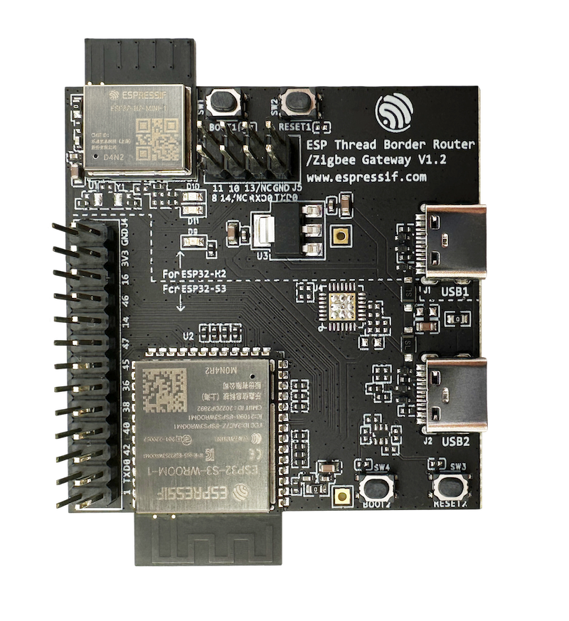

## Riassunto personale
- utilizzare l'esempio nella directory `examples/basic_thread_border_router`. Questo esempio è destinato alla `scheda embedded border router di espressif`. La scheda è composta da un `Soc esp32-s3 (WIFI support)` e un `esp32-h2 (THREAD support)`.
- plug usb nella usb port dell'esp32-s3 (USB2).
- apri progetto con vscode
- seleziona scheda `esp32-s3` e poi seleziona JTAG (seconda opzione disponibile) oppure ESP-PROG (prima opzione disponibile).
- seleziona flash method (icona stella) e seleziona UART
- configura variabili dell'sdk (premi rotella oppure cerca \> menuconfig). Ecco le variabili da configurare (fare particolare attenzione a CONFIG_OPENTHREAD_BR_AUTO_UPDATE_RCP, consiglio di disattivare le variabili utilizzando menuconfig e NON modificando manualmente sdkconfig):
```
CONFIG_EXAMPLE_WIFI_SSID="xxx"
CONFIG_EXAMPLE_WIFI_PASSWORD="xxx"
CONFIG_EXAMPLE_WIFI_CONN_MAX_RETRY=1000

# CONFIG_OPENTHREAD_BR_AUTO_UPDATE_RCP is not set (ho dovuto disattivarlo altrimenti non buildava!!!)
# CONFIG_OPENTHREAD_BR_CREATE_OTA_IMAGE is not set
CONFIG_OPENTHREAD_BR_AUTO_START=y # avvia in automatico br con wifi configurato
CONFIG_OPENTHREAD_BR_START_WEB=y # avvia web server di debug
```
- build, flash e apri il monitor seriale per inviare comandi via CLI (es ping 192.168.1.84).
- carica il codice `ot_cli` negli altri `esp32-c6` oppure `esp32-h2` e osserva come joinano il thread network da web server o via nmap.
### Note sul Web server
se vuoi visualizzare il web server devi digitare nel browser `192.168.1.X/index.html`, se lo scrivi senza *index.html* restituisce 404. Per trovare il dispositivo espressif usa `nmap -sP 192.168.1.0/24`


# ESP Thread Boarder Router SDK

ESP-THREAD-BR is the official [ESP Thread Border Router](https://openthread.io/guides/border-router/espressif-esp32) SDK. It supports all fundamental network features to build a Thread Border Router and integrates rich product level features for quick productization.

# Software Components


The SDK is built on top of [ESP-IDF](https://github.com/espressif/esp-idf) and [OpenThread](https://github.com/openthread/openthread). The OpenThread port and ESP Border Router implementation is provided as pre-built library in ESP-IDF.

# Hardware Platforms

## Wi-Fi based Thread Border Router

The Wi-Fi based ESP Thread Border Router consists of two SoCs:

* An ESP32 series Wi-Fi SoC (ESP32, ESP32-C, ESP32-S, etc) loaded with ESP Thread Border Router and OpenThread Stack.
* An ESP32-H 802.15.4 SoC loaded with OpenThread RCP.

### ESP Thread Border Router Board

The ESP Thread border router board provides an integrated module of an ESP32-S3 SoC and an ESP32-H2 RCP.



The two SoCs are connected with following interfaces:
* UART and SPI for serial communication
* RESET and BOOT pins for RCP Update
* 3-Wires PTA for RF coexistence

### Standalone Modules

The SDK also supports manually connecting an ESP32-H2 RCP to an ESP32 series Wi-Fi SoC.

ESP32 pin           | ESP32-H2 pin
--------------------|-------------
  GND               |     G
  GPIO17 (UART RX)  |     TX
  GPIO18 (UART TX)  |     RX
  GPIO7             |     RST
  GPIO8  (SPI INTR) |     GPIO9 (BOOT)
  GPIO10 (SPI CS)   |     GPIO2
  GPIO11 (SPI MOSI) |     GPIO3
  GPIO12 (SPI CLK)  |     GPIO0
  GPIO13 (SPI MISO) |     GPIO1

Note that the SPI GPIOs are optional, if the UART is selected for communication.

The following image shows an example connection between ESP32 DevKitC and ESP32-H2 DevKitC:


In this setup, only UART interface is connected, so it doesn't support RCP Update or RF Coexistence features. You can refer to [ot_br](https://github.com/espressif/esp-idf/tree/master/examples/openthread/ot_br) example in esp-idf as a quick start.

## Ethernet based Thread Border Router

Similar to the previous Wi-Fi based Thread Border Router setup, but a device with Ethernet interface is required, such as [ESP32-Ethernet-Kit](https://docs.espressif.com/projects/esp-idf/en/latest/esp32/hw-reference/esp32/get-started-ethernet-kit.html).

# Provided Features

These features are currently provided by the SDK:

* **Bi-directional IPv6 Connectivity**: The devices on the backbone link (typically Wi-Fi) and the Thread network can reach each other.
* **Service Discovery Delegate**: The nodes on the Thread network can find the mDNS services on the backbone link.
* **Service Registration Server**: The nodes on the Thread network can register services to the border router for devices on the backbone link to discover.
* **Multicast Forwarding**: The devices joining the same multicast group on the backbone link and the Thread network can be reached with one single multicast.
* **NAT64**: The devices can access the IPv4 Internet via the border router.
* **RCP Update**: The built border router image will contain an updatable RCP image and can automatically update the RCP on version mismatch or RCP failure.
* **Web GUI**: The border router will enable a web server and provide some practical functions including Thread network discovery, network formation and status query. 
* **RF Coexistence**: The border router supports optional external coexistence, a feature that enhances the transmission performance when there are channel conflicts between the Wi-Fi and Thread networks.

# Resources

* Documentation for the latest version: https://docs.espressif.com/projects/esp-thread-br/. This documentation is built from the [docs directory](docs) of this repository.

* The [esp32.com forum](https://esp32.com/) is a place to ask questions and find community resources.

* [Check the Issues section on github](https://github.com/espressif/esp-thread-br/issues) if you find a bug or have a feature request. Please check existing Issues before opening a new one.

* If you're interested in contributing to ESP-THREAD-BR, please check the [Contributions Guide](https://docs.espressif.com/projects/esp-idf/en/latest/contribute/index.html).
